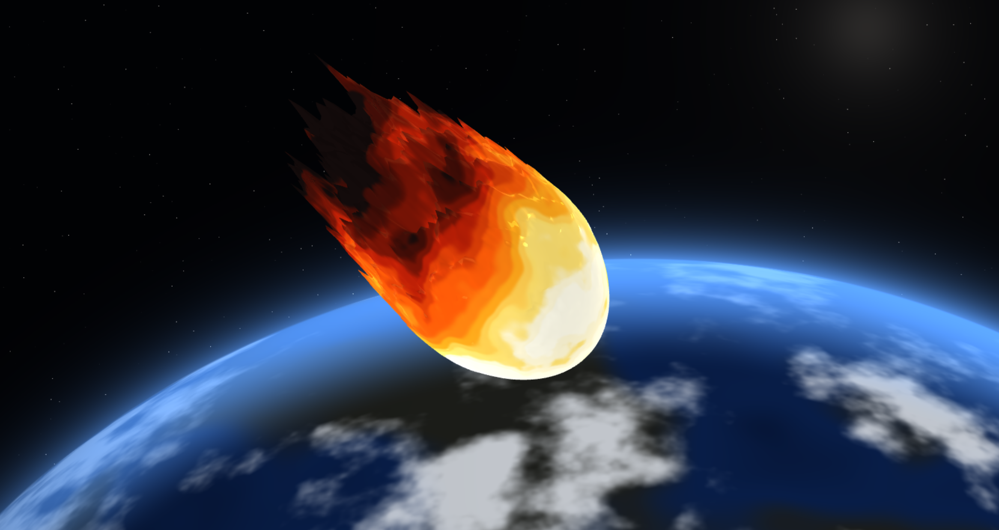

# WebGL Fireball — Meteor Over Earth

A procedural fireball built in GLSL: an icosphere bent into a flame by a
vertex shader, colored by a height-driven gradient in a fragment shader, and set
against a procedurally generated Earth.



**Live demo: [fireball.tonyxtian.com](https://fireball.tonyxtian.com)**

*CIS 5660 — Homework 1. Base code from the course repository.*

---

## What it does

The scene is two shader programs and two pieces of geometry:

| | Geometry | Shaders |
|---|---|---|
| **Fireball** | Icosphere, up to 10,242 vertices | `lambert-vert.glsl`, `lambert-frag.glsl` |
| **Background** | Full-screen quad | `background-vert.glsl`, `background-frag.glsl` |

The background is drawn first with the depth test disabled, so it neither tests
nor writes depth and can never occlude the flame.

## Vertex shader — making fire, not a blob

A sphere displaced along its normals looks like a liquid blob, because it bulges
in every direction at once. Fire does not. So the displacement here is
**directional**:

1. **Teardrop base.** The sphere is stretched vertically and its cross-section is
   eased inward above the waist, giving a wide round root and a narrower crown.
2. **Displacement along +Y only.** Every offset is `vec3(0, h, 0)`, scaled by a
   mask that is 0 at the root and 1 at the crown. The base stays anchored and
   smooth while the top frays — which is what reads as flame rather than fluid.
3. **Low-frequency layer** (`f(x, y, z) = h`): a product of three sinusoids at
   incommensurate frequencies, plus a vertical ripple and a slower swell. This is
   the large, slow sway of the flame body.
4. **High-frequency layer:** multi-octave value-noise FBM at lower amplitude.
   Sharpened and clamped to a strictly positive term confined to the upper half,
   it becomes the licking tongues along the crown.
5. **Recomputed normals.** Without this the lighting still reads as a smooth
   sphere and none of the displacement shows. Normals are rebuilt per vertex by
   finite differencing across the displaced surface.

Everything is animated from a `u_Time` uniform: the sinusoid phases advance, the
FBM sample point marches *downward* through the noise field so detail appears to
stream up the flame, and a sawtooth-driven impulse makes the whole flame surge
and settle on a loop that is continuous across the wrap.

## Fragment shader — hottest at the root

Color is driven primarily by **position along the flame**, since fire is fed at
its base and cools as it rises. The gradient runs white-hot → straw → amber →
orange → deep red → charred, with a gain curve that widens the white core at the
bottom and deepens the char at the tip.

On top of that:

- **Correlated with the displacement**, as the assignment requires: a tongue that
  has pushed further from the fuel reads cooler than the body it came from.
- **Warped by flowing per-pixel noise.** This is what makes the color boundaries
  meander and reconnect. It has to be evaluated per fragment — a value
  interpolated from the vertices can only ever produce straight edges between
  them.
- **Quantized into bands** with a controllable soft edge, for a painted,
  cel-shaded look that ranges from hard steps to an unbroken gradient.
- **Rim glow** gated by heat, so the charred crown keeps a hard dark edge, plus
  scattered embers still glowing in the burnt tip.

## Background — a procedural Earth

The planet is a single circle with a radius far larger than the screen, centered
well below it, so only a shallow arc is ever visible. That is what makes it read
as the limb of something enormous rather than a ball sitting in frame.

- The **sphere normal is reconstructed** from the disc coordinate, so the surface
  is genuinely shaded and textured as a sphere.
- **Continents and two drifting cloud layers** come from the same FBM, sampled
  along that normal and rotated slowly.
- The **atmosphere** is an exponential falloff outside the disc, gated by the sun
  direction so only the lit limb scatters. This is the band that blends the
  planet up into black.
- **Stars** come from a hashed grid with most cells left empty, and a soft sun
  glow sits just off the top-right corner along the same direction that lights
  the planet.

## Toolbox functions

Six distinct functions across the two fireball shaders:

| Function | Where | Used for |
|---|---|---|
| `bias` | both | shaping noise, biasing the gradient hotter or cooler |
| `gain` | both | contrast around the midpoint of the gradient and the noise |
| `sawtooth` | vertex | the looping surge clock |
| `expImpulse` | vertex | fast-attack / slow-decay surge envelope |
| `smootherstep` | both | height masks, palette stop blending, soft band edges |
| `cubicPulse` | fragment | embers in the charred crown |

## Controls

Seventeen live parameters, grouped into folders, plus a **Reset Defaults** button
that restores the art-directed values.

| Folder | Controls |
|---|---|
| **Flame shape** | tesselations, flame height, taper |
| **Displacement** | sway amount, sway scale, detail amount, detail scale, fbm octaves |
| **Animation** | roil speed, pulse period, pulse strength |
| **Color** | heat, color flow, color bands, band blend |
| **Background** | horizon, atmosphere |

Drag to orbit the camera, scroll to zoom.

## Running locally

```bash
npm install
npm run dev
```

Then open the URL Vite prints. `npm run build` type-checks and produces a
production build in `dist/`. Site deployed to a personal VPS.

## Credits

Base code and assignment by the CIS 5660 course staff. Reference fireball image
by Aidan Gideon, CIS 5660 Fall 2025.
